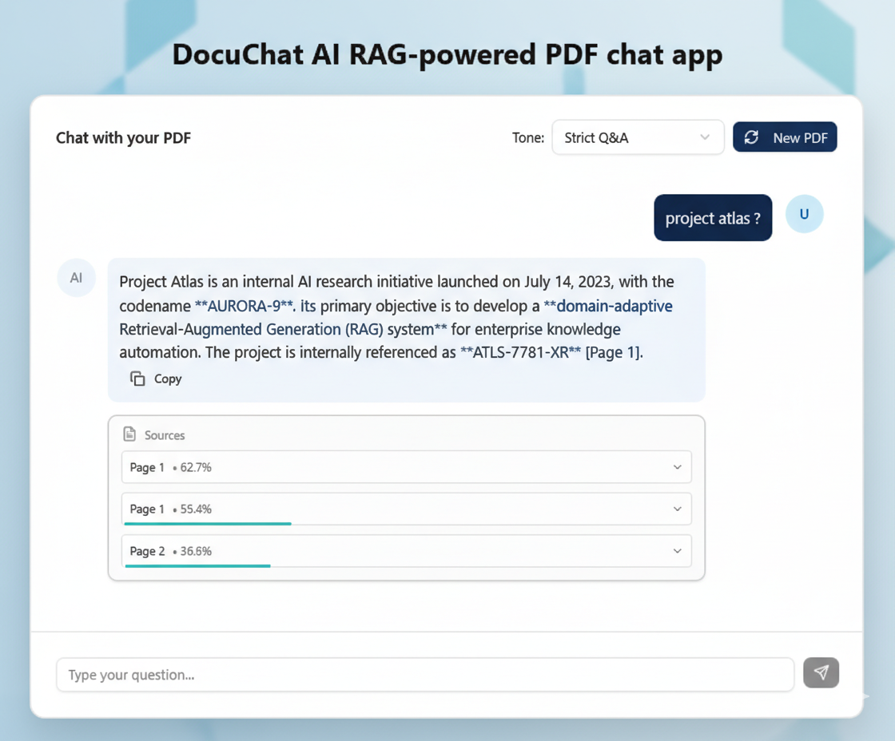

[](https://tanveer-docuchat-ai.vercel.app)
# 📄 AI PDF RAG – Streaming Chat with Sources
DocuChat AI is a production-ready, **Retrieval-Augmented Generation (RAG)** powered PDF chat application that allows users to upload documents and ask natural language questions — with cited page references and transparent source tracking. built with:



* **Next.js (App Router)**
* **Streaming LLM responses**
* **OpenRouter**
* **Supabase + pgvector**
* **HuggingFace embeddings**

Upload a PDF → Generate embeddings → Store vectors → Ask questions → Receive **streamed answers with sources**.

---

# 🚀 Features

* 📥 PDF upload & validation
* ✂️ Character-aware chunking
* 📄 Page-aware source mapping
* 🧠 Batched embedding generation
* 🗄 Vector storage using pgvector
* 🔎 Semantic similarity search
* 💬 Streaming AI responses
* 📚 Source injection before answer
* 🛡 Safe error handling & stream cleanup

---

# 🏗 Architecture Overview

```text
Client
   ↓
/api/process-pdf
   ↓
Validation → Extraction → Chunking → Embeddings → Supabase (pgvector)

Client
   ↓
/api/chat
   ↓
Query Embedding → Vector Search → System Prompt Builder
   ↓
OpenRouter LLM (streamed)
   ↓
ReadableStream → Client
```

---

# 📂 Important Folder Structure

## App Routes

```
app/
 └── api/
     ├── chat/route.ts          # Streaming RAG chat endpoint
     └── process-pdf/route.ts   # PDF processing & embedding pipeline
```

---

## Core RAG Logic

```
lib/
 ├── pdf/
 │   ├── validation.ts        # File + content validation
 │   ├── extractText.ts       # PDF text extraction
 │   ├── chunkText.ts         # Text chunking (char-aware)
 │   ├── pageMapping.ts       # Page approximation logic
 │   ├── createEmbedding.ts   # HuggingFace embedding generation
 │   ├── getEmbedding.ts      # Single query embedding
 │   └── saveEmbeddings.ts    # Batched vector insert
 │
 ├── buildSystemPrompt.ts     # Injects sources into prompt
 ├── supabaseAdmin.ts         # Supabase admin client
 ├── tokenizer.ts             # Token counting utilities
 ├── utils.ts                 # Shared helpers
 └── withTimeoutPromise.ts    # Timeout protection wrapper
```

---

## UI Components

```
components/
 ├── ChatInterface.tsx
 ├── FileUpload.tsx
 ├── RoleSelector.tsx
 └── ui/                      # Reusable UI primitives
```

---

# 📡 API Endpoints

## 1️⃣ Process PDF

```
POST /api/process-pdf
```

* Validates file
* Extracts text
* Chunks document
* Generates embeddings
* Stores vectors in Supabase

Response:

```json
{
  "success": true,
  "sessionId": "uuid"
}
```

---

## 2️⃣ Chat with Document

```
POST /api/chat
```

* Embeds user question
* Performs vector similarity search
* Builds system prompt with sources
* Streams LLM response

Response:

* Streaming text output
* Sources metadata sent first
* Clean stream termination

---

# 🔄 Streaming Strategy

The `/api/chat` endpoint:

1. Sends sources immediately
2. Streams model tokens progressively
3. Handles cancellation safely
4. Cleans up reader on failure
5. Injects fallback `[STREAM_ERROR]` marker if needed

This ensures:

* Low latency
* Minimal memory usage
* Production-safe streaming behavior

---

# 🧠 Retrieval Flow

1. User question → embedding
2. Vector similarity search (pgvector)
3. Top chunks retrieved
4. System prompt constructed with citations
5. LLM generates streamed answer

---

# 🔐 Environment Variables

```
OPENROUTER_API_KEY=
HUGGINGFACE_API_KEY=
SUPABASE_URL=
SUPABASE_SERVICE_ROLE_KEY=
```

---

# ⚙️ Tech Stack

* Next.js 14+
* TypeScript
* Supabase
* pgvector
* OpenRouter
* HuggingFace
* LangChain TextSplitter

---

# 🛡 Production Considerations

* Batched embedding inserts
* Chunk limits enforced
* Validation before processing
* Stream cancellation handling
* Timeout protection utilities
* Modular architecture for scaling

---

# 📈 Future Enhancements

* Background job queue for PDF processing
* Hybrid search (BM25 + vector)
* Reranking layer
* Redis caching
* Multi-tenant isolation
* Rate limiting
* Document status tracking

---

# 📜 License

MIT

---
## 👨‍💻 About the Author

Built with a focus on scalable RAG architecture, streaming LLM integration, and production-ready design.

**Tanveer H.**  
Frontend AI Developer  

🌐 Portfolio: https://tanveer-portfolio.vercel.app/en-US/work
💼 LinkedIn: https://linkedin.com/in/tanveer-h1  
📧 Contact: https://tanveer-portfolio.vercel.app/en-US/contact  
